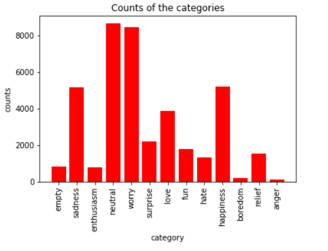
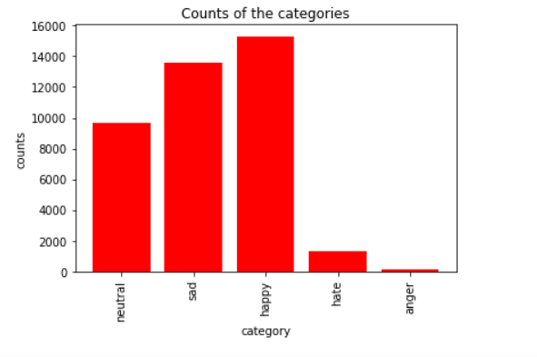

# Sentiment/Emotion Analysis

Live depoloyment can be seen here.  
https://rocky-garden-38647.herokuapp.com

## To run locally
1. To run the server you will need to install some dependencies.
namely herokuCLI, Django, and postgresql installed 

1. Once you have all the dependencies simple run `heroku local web`. This will run the server locally.

1. Once the server is running head to `0.0.0.0:5000` in your perfered browser
1. Alternatively you can play with a live deployment at the link at the top of readme.

## Data
The data set we used for this project was The Emotion in Text data set by CrowdFlower 
https://www.crowdflower.com/wp-content/uploads/2016/07/text_emotion.csv. 

This data contains 40k tweets that were originally labeled with 13 classes, below are the counts for these classes. 

Since there are way to many classes and some are redundant (like enthusiastic and happy) we combined them into 5 final classes.
Below are the counts for the final 5 classes> 

From the above image, it is clear that the data is skewed as there are rarely any angry/hate texts. This can affect our model.

## Models
### Sentiment Analysis
Logistic Regression trained with 5 fold cross validation on 70k review sentences
Uses tdidf weights and bigrams.

We've tested trigrams and unigrams but found that bigrams worked best.

### Emotion Analysis
We trained a multiclass logistic regression model using 5 fold cross
validation on 40k Twitter tweets. The mode uses tdidf weights and bigrams.

We've experimented with trigrams and unigrams but again found bigrams worked
best.

The original dataset had 13 classes but we binned similar classes down to 5
total classes.

## Acknowledgement
The 'Emotion in Text' dataset by CrowdFlower
